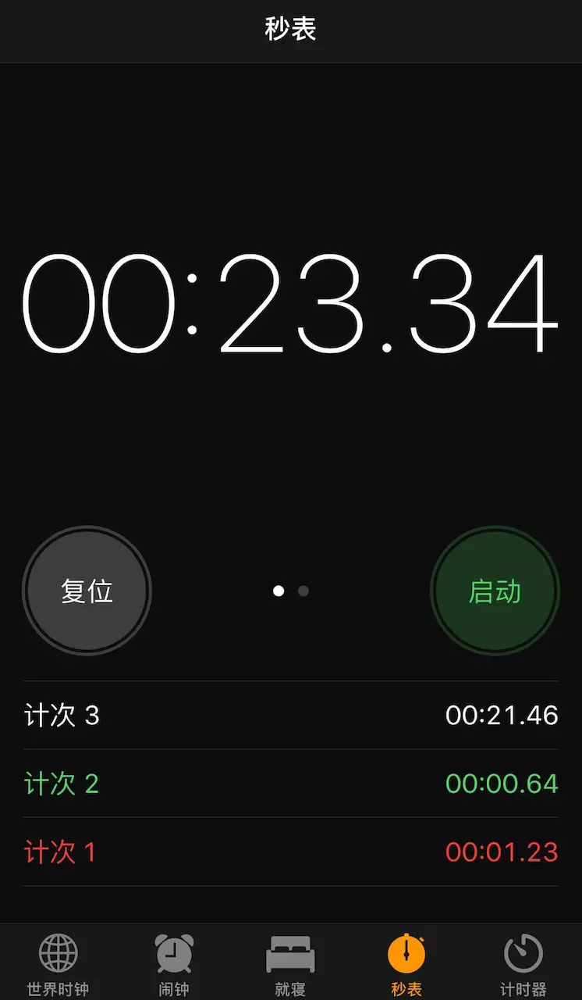

# React 练习题 - 秒表

## 效果图

## 要求
 - `1` 按下右侧“启动”按钮，这个按钮就会变成“停止”，同时上面的数字时钟开始计时；按下“停止”按钮，数字时钟停止计时。
 - `1` 左侧有一个按钮，初始状态显示“复位”，点击该铵钮会清空时钟；
开始计时之后，这个左侧按钮会变成“计次”，按一下“计次”，秒表底部就会增加一列时间，记录下按下“计次”这一瞬间的时刻。
- `2` 组件尽量细分
- `2` 结合mobx

## 提交
 - 在本目录下新建个人文件夹，如 `/sandboat`